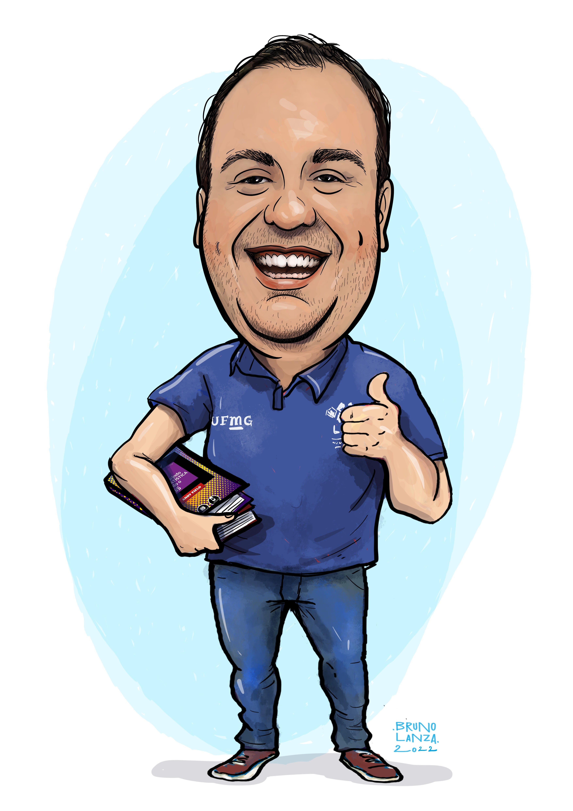

## 👋 Hi, I’m Maicon Albuquerque

I’m an Associate Professor at the Federal University of Minas Gerais (UFMG), Brazil, and Director of the UFMG Sports Training Center. I hold a PhD in Molecular Medicine and a Master’s in Sport Sciences, and I am a CNPq Research Productivity Fellow in Physiology and Neuroscience.

### 👀 I’m interested in:
- Neuroscience of sports and physical activity  
- Neuropsychology applied to sport and physical exercise  
- Combat sports  
- Genetics and sports performance  
- Computational analysis in sport sciences and psychology

### 🌱 I’m currently learning:
- Advanced statistical modeling (GEE, GLM, SEM, SPM)  
- Python and R for data science in health and sports

### 💞️ I’m looking to collaborate on:
- Research in neuroscience and sports performance  
- Projects involving EEG, tDCS, and cognitive assessment during exercise  
- Machine learning models applied to behavioral and physiological data

### 📫 How to reach me:
- Email: maiconbhz@ufmg.br  
- Website: https://maiconbhz.github.io  
- Lattes: [http://lattes.cnpq.br/6882672148403531](http://lattes.cnpq.br/6882672148403531)  
- ORCID: [https://orcid.org/0000-0001-6021-8480](https://orcid.org/0000-0001-6021-8480)  
- Google Scholar: [https://scholar.google.com.br/citations?user=JRq7A1EAAAAJ](https://scholar.google.com.br/citations?user=JRq7A1EAAAAJ)

### 😄 Pronouns:
He/Him (Ele/Dele)

### ⚡ Fun fact:
I was a competitive swimmer in my youth and later found a passion for Taekwondo, in which I proudly hold a black belt.

